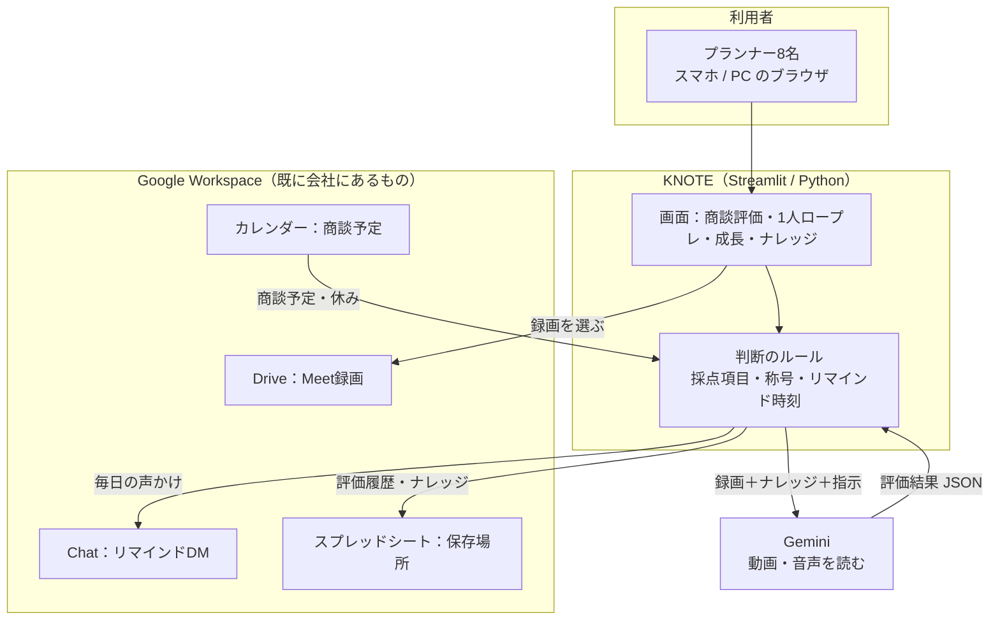
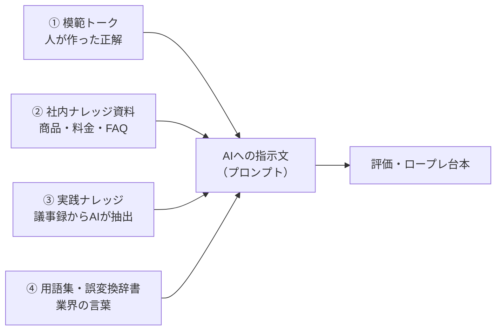
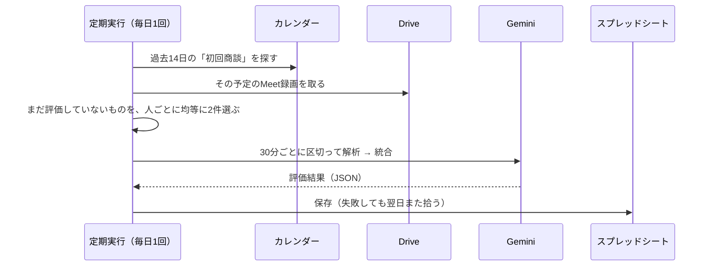

# KNOTE 設計の考え方と全体像

**他部署で同じ仕組みを作るときの下敷きにする資料です。**
KNOTE（ノート）は営業部のために作った「商談・ロープレをAIが振り返るWebアプリ」ですが、
ここに書いてある**ナレッジの持ち方**と**AIの入れ方**は、施工部でもそのまま使えます。

| | |
|---|---|
| 対象読者 | 施工部でツールを作りたい人／開発を手伝う人 |
| 前提知識 | プログラミングの知識は不要。「何をどう考えて作ったか」が分かる粒度で書いています |
| 現状 | 営業プランナー8名が毎日利用中。コード約1万行・自動テスト479件 |
| URL | https://talknot-lts.streamlit.app （社内ドメインのGoogleアカウントのみ） |

---

## 1. このアプリが解いている問題

営業の「うまい人のやり方」は、その人の頭の中にしかありませんでした。

- 商談に同行できる回数は限られる。上長が全員の商談を見るのは物理的に無理
- 振り返りは記憶頼りで、「なんとなく良かった／悪かった」で終わる
- 新人が伸びるかどうかが、たまたま誰の下についたかで決まってしまう

KNOTE はここに **「全員の商談を、同じ基準で、毎回言語化する」** 仕組みを入れました。

**施工部に置き換えると**：ベテランの段取り・納まりの判断・お客様対応が個人の頭にあり、
若手が同じ品質に届くまで時間がかかる、という同じ構造の問題に使えます。

---

## 2. 全体像



**特徴は「新しいものをほとんど増やしていない」こと**です。
保存先はスプレッドシート、動画はDrive、連絡はGoogle Chat、予定はカレンダー。
会社に既にあるものをつなぎ、足りない「AIで読む」「基準で採点する」だけを作っています。
そのため専用サーバーもデータベースも要らず、費用はほぼゼロで運用できています。

---

## 3. 設計の柱（5つ）

### ① ナレッジは「唯一の真実」を1か所に置く

同じことを2か所に書くと、必ず片方が古くなります。KNOTE では

- 評価項目（5項目）は `config/settings.py` の1か所にだけ書く
- 画面表示も、AIへの指示文も、結果の保存形式も、**すべてそこを参照する**

としています。項目を増やすときに直すのは1か所だけ。ズレようがない構造にしています。

### ② AIは「読む・書く」係。判断の基準は人が持つ

AIに丸投げすると、日によって甘口・辛口が変わり、評価として信用されません。

| 人が決めること（コードに書く） | AIに任せること |
|---|---|
| 何を評価するか（5項目・2視点） | 録画から何が起きたかを読み取る |
| 何点なら高評価か（20点以上＝良い回） | その場面がどの項目に当たるか判断する |
| 称号の条件・相棒の育ち方 | 改善案の文章を書く |
| リマインドを送る時刻・休みの判定 | 議事録から実践ナレッジを抜き出す |

「ものさしは人が持ち、目と口をAIに任せる」。この線引きが評価の一貫性を守っています。

### ③ 保存はスプレッドシート

データベースを立てず、Googleスプレッドシートに保存しています。理由は3つ。

1. **中身を人が直接見て直せる**（管理者がシートを開けば全記録が読める）
2. 権限管理・バックアップ・共有がGoogle任せで済む
3. サーバー代・保守がかからない

「開発者しか触れないブラックボックス」を作らないための選択です。

### ④ 続けさせる仕組みを、機能として作る

良いツールでも使われなければ意味がありません。**続ける動機**そのものを機能にしています
（称号・相棒キャラ・毎日の声かけ・ロープレの揺らぎ。詳細は §7）。

### ⑤ 段階的に出す

毎日使う人がいるので、いきなり全員には出しません。
まず1名（先行公開）で確認 → 問題なければ全員。
画面に出る機能は「フラグ」で隠せるようにしてあり、コードを入れても表示は変わりません。
詳細は `docs/RELEASE_FLOW.md`。

---

## 4. ナレッジの考え方（ここが移植の核心）

AIは賢いですが、**自社のことは何も知りません**。「弊社のダウンライトはLDKのシーリングを
置き換える工事だ」ということは、教えない限り分かりません。
そこで KNOTE は、社内の知識を**4つの層**に分けて持っています。



| 層 | 中身 | 誰が作る | 更新のしかた |
|---|---|---|---|
| ① 模範トーク | 社内標準の話し方。単元（会社説明・コーティング…）ごとの台本 | 人（営業の上長） | 元のスプレッドシートを直す → 取り込み |
| ② 社内ナレッジ資料 | 商品仕様・料金・サービス・FAQ | 人 | Driveのフォルダに置く → 画面のボタンで取り込み |
| ③ 実践ナレッジ | 実際の商談議事録から「使えた切り返し」をAIが抽出したもの | AI（毎日自動） | 議事録が増えれば自動で増える |
| ④ 用語集・誤変換辞書 | 入隅・出隅・巾木・引掛シーリング等。AIが聞き間違えやすい語 | 人 | 誤変換を見つけたら1行足す |

### なぜ4層に分けるのか

- **①②は変えてはいけない正解**。AIに書き換えさせない
- **③は増え続ける生の知恵**。人が書く余裕はないのでAIに集めさせる
- **④は精度の問題**。「入隅」を「入り墨」と誤変換された実例があり、辞書で潰しています

### ナレッジの実際の置き場所（このアプリが読んでいる先）

「どこを直せばAIの答えが変わるか」が分かるように、実物の場所を書いておきます。
リンク先を開くには、それぞれの共有権限が必要です。

| 層 | 実物 | 場所 |
|---|---|---|
| ① 模範トーク（商材別・14タブ） | スプレッドシート | [1bUrsQxKIg7D…](https://docs.google.com/spreadsheets/d/1bUrsQxKIg7DZc-DANvHRqR4ygeEQEOvckZTpeGlmyEs/) |
| ① 模範トーク（説明トーク部品別・22タブ） | スプレッドシート | [1A92RANfvc9z…](https://docs.google.com/spreadsheets/d/1A92RANfvc9zQz18b9aG4fnSlurKAqBVr0iWAzGSAX1k/) |
| ② 社内ナレッジ資料（商品・料金・FAQ） | Driveフォルダ | [15Q4Ei08Xubf…](https://drive.google.com/drive/folders/15Q4Ei08Xubfib_0T2HcwYpdk93BDudl8) |
| ③ 実践ナレッジの元（商談議事録） | Driveフォルダ | [14yefycrO6yl…](https://drive.google.com/drive/folders/14yefycrO6ylPVT0LAqbh10HjrDV-9FDd) |
| ④ 用語集・誤変換辞書 | コード内 | `config/settings.py`（`INDUSTRY_GLOSSARY` / `TRANSCRIPT_FIXES`） |
| 商談・ロープレの録画 | 各自のDrive（Meet録画） | サービスアカウントが**読み取り専用**で参照 |
| 保存先（評価履歴・ナレッジ） | スプレッドシート | IDは Secrets 管理（`KNOWLEDGE_SHEET_ID`） |
| 利用ログ（LTS共通） | スプレッドシート | [17et2dnkgLsx…](https://docs.google.com/spreadsheets/d/17et2dnkgLsxpb9cdbKgDRmmkI5hB_LYyMYtqxZhIhUU/) |

取り込みの入口：

| やりたいこと | 操作 |
|---|---|
| 模範トークを更新した | `scripts/import_talk_scripts.py` を実行（色付きセルを【見出し】として構造化して取り込む） |
| ロープレの台本に反映したい | GitHub Actions の `rebuild-scenarios` を手動実行 |
| 社内ナレッジ資料を追加した | アプリの管理者画面のボタンから取り込み |
| 議事録を追加した | 何もしなくてよい（毎日自動で抽出される） |

**フォルダIDは `config/settings.py` に既定値として書いてあります**（鍵ではないので
コードに入れて構いません）。差し替えるときは `.env` / Secrets で上書きできます。

### 派生して作られるもの

①〜④から、AIが次の2つを自動生成します（人が確認して直せます）。

- **お客様ペルソナ** … 実際の議事録から作った「よくあるお客様の反応・不安・断り文句」
- **コーチングの切り口** … 商材×お客様タイプごとの「どう進めるとよいか」

### 施工部で作るなら

| KNOTE（営業） | 施工部での対応物（例） |
|---|---|
| 模範トーク | 標準施工手順・納まりの基準・現場写真の良い例 |
| 社内ナレッジ資料 | 商品仕様・施工要領書・注意点 |
| 実践ナレッジ | 日報・是正報告からAIが抽出した「現場の学び」 |
| 用語集 | 建築用語・部材名（そのまま流用できます） |

---

## 5. AIの入れ方

### 使う場面と、あえて使わない場面

| 場面 | AIを使うか | 理由 |
|---|---|---|
| 商談録画の評価 | 使う | 人が全部見るのは不可能 |
| ロープレの評価 | 使う（最後に1回だけ） | — |
| **ロープレの会話中** | **使わない** | 台本で進める。毎ターンAIを呼ぶと費用も待ち時間も増える |
| 議事録からの知恵の抽出 | 使う（毎日自動） | 量が多く、人手では続かない |
| 採点の基準・称号の判定 | 使わない | ブレたら評価として信用されない |
| リマインドの送信判断 | 使わない | 深夜に送る等の事故を確実に防ぐ |

### AIへの指示文（プロンプト）の組み立て方

指示文は毎回、次の順で組み立てています。

1. **役割** … 「あなたは住宅インテリアオプション営業のコーチです」
2. **確定情報** … カレンダーの予定名から取った「お客様名・物件名・担当者名」
   （※これを渡さないと、AIは聞き取れなかった人名をカタカナで創作します。
   実際に「安栗」を「アングリ」と書いた事故があり、確定情報を渡して解決しました）
3. **ナレッジ** … §4の①〜④
4. **前回の宿題** … 前回AIが出した改善点1つ（できたか答え合わせさせる）
5. **出力形式** … 項目名・点数の範囲・書き方をJSONで厳密に指定

### 出力を壊さないための工夫

AIの出力は不安定です。そのまま信じると画面が壊れます。実際に起きた事故と対策：

| 起きたこと | 対策 |
|---|---|
| JSONが途中で切れる | 途中で切れたJSONを修復してから読む |
| 26点／25点満点になる | 定義にない項目は捨てる |
| 時系列が前後する | 保存時に時刻順へ並べ直す |
| 「もちろん」が300回続く | 繰り返しを畳む |
| 通信が切れる・混雑する | 一時的なエラーだけ待って再試行 |
| 長い録画の前半しか評価されない | **30分ごとに区切って解析し、結果を統合**（読み取り3%→97%） |

### 費用の抑え方

- モデルは用途で使い分け（評価＝高性能、議事録抽出＝軽量）
- 自動評価は**1日2件まで**。残りは翌日に持ち越し（無料枠に収める）
- 動画はフレームを間引いて（0.5fps）読む。身振りは十分読み取れて、費用は下がる
- ロープレのAI呼び出しは1セッション1回だけ

---

## 6. データの流れ

### 商談の自動評価（毎日・全自動）



プランナーは**何もしなくても**、翌日には自分の商談の振り返りが増えています。

### 1人ロープレ（本人が操作）

台本のお客様が話す → 声で返答 → 全ターン終了 → AIが1回で評価。
相手役がいなくても、いつでも1人で練習できます。

---

## 7. 続けさせる仕組み

評価が良くても、使わなくなれば終わりです。次の4つを機能として入れています。

| 仕組み | 中身 |
|---|---|
| **称号（110種）** | 「初めの一歩」「7日連続」「20点以上を10回」など。年代・性別を問わず刺さるよう幅を持たせ、随時追加 |
| **相棒キャラクター** | ロープレを続けると育つドット絵のキャラ。6種類から1体を選んで育て、名前を付けられる。育つのは選んだ1体だけなので「自慢の1体」になる |
| **毎日の声かけ** | 未実施の人にGoogle ChatでDM。文面は30種を日替わり。**各自のカレンダーで休みを判定**し、休みの日は送らない。送信は日本時間14〜17時のみ |
| **ロープレの揺らぎ** | 台本の暗記防止。お客様の温度感×同席者×気にしていることを毎回引き直し（175通り）、台本にない横やり質問が割り込む |

**設計の思想は「叱らない」こと**。相棒は放置しても死なず、眠って待つだけ。
連続記録が途切れた人に「途切れました」とは言いません。続けたくなる方向にだけ力を使います。

---

## 8. 保存先の設計

すべて1つのスプレッドシートの中で、タブで分けています。

| タブ | 中身 |
|---|---|
| Evaluations | 評価履歴（誰が・いつ・何を・結果JSON） |
| Knowledge / KnowledgeDoc | 弊社ナレッジ（箇条書き／まとまった文書） |
| TalkScripts | 模範トークスクリプト（単元ごと） |
| MeetingInsights | 議事録から抽出した実践ナレッジ |
| ReminderLog | その日リマインドを送った相手（二重送信の防止） |
| Feedback | ご意見箱への投稿 |
| Companion | 相棒の選択・名前 |

**注意点**：1セルは50,000文字までです。長い評価結果はそのままだと保存に失敗します。
KNOTE では「重要な部分（1ポイント・点数・要約）を残し、長い部分から削る」ようにしています。

> 過去に「消してから書く」順で保存していて、書き込みに失敗した時に全記録が消える事故が
> ありました。今は**先に書いてから余りを消す**順にしています。保存処理を書くときは
> この順番を必ず守ってください。

---

## 9. 権限とセキュリティ

- ログインはGoogleアカウント。**社内ドメインのみ**許可
- 権限は3段階：一般（自分の記録）／閲覧専用（全員の記録を見るだけ）／管理者（ナレッジ編集可）
- 他人の録画を読むためのサービスアカウントは**読み取り専用**
- 鍵ファイルはコードに含めない（GitHubのSecretsとStreamlitのSecretsに置く）
- 録画・評価結果の実体はリポジトリに入れない

---

## 10. 自動で動いているもの

| 名前 | 頻度 | 役割 |
|---|---|---|
| auto-evaluate | 毎日1回 | 初回商談の自動評価（1日2件） |
| roleplay-reminder | 1時間ごと | 14〜17時のときだけリマインド送信 |
| daily-minutes | 毎日 | 議事録から実践ナレッジを抽出 |
| keepalive | 定期 | アプリを起こしておく |
| rebuild-scenarios | 手動 | ロープレ台本の作り直し |

> 定期実行（GitHub Actions）は**指定時刻どおりには動きません**。実測で1〜3時間、
> 最大12時間遅れたことがあります。「12:40指定が翌0:38に動いてプランナーに深夜DMが届く」
> 事故が起きました。**時刻に意味がある処理は、cronではなくコード側で時刻を判定**してください。

---

## 11. 品質の担保

自動テスト479件。テストは「壊れたら困る約束」を日本語で書いています。

```
def test_midnight_is_blocked():
    """深夜に届かないための門番。実際に 0:37 にDMが飛ぶ事故が起きた。"""
```

**過去に一度でも起きた事故は、必ずテストにする**というルールで運用しています。
テストは仕様書も兼ねていて、読めば「何を守っているか」が分かります。

---

## 12. 施工部版をつくるなら

**作り直すのは3か所だけ**です。骨組み（ログイン・保存・AI呼び出し・自動実行・称号）は
そのまま使えます。

| 差し替えるもの | 具体的に |
|---|---|
| **① 評価項目** | 「お客様の感情をつかめたか」等の5項目を、施工の評価軸に置き換える（例：安全確認・納まりの精度・お客様への説明・段取り・後片付け） |
| **② ナレッジ** | 模範トーク → 標準施工手順／社内資料 → 施工要領書／実践ナレッジ → 日報 |
| **③ 入力するもの** | 商談録画 → 現場写真・施工動画・日報 |

現実的な進め方の案：

1. まず **①評価項目を紙に書く**（ここが決まらないと何も作れません）
2. 手元の写真か動画を1件、AIに読ませて出力を見る（コードを書く前でも試せます）
3. 出力が使えそうなら、KNOTE のコードをコピーして②③を差し替える

**最初に決めるべきは「何を良しとするか」**であって、技術ではありません。
KNOTE も、評価5項目を決めるところに一番時間をかけました。

---

## 13. ファイル構成

```
app.py                  画面（唯一の入口。ログイン → タブUI）
config/settings.py      設定と評価項目の唯一の真実
core/                   判断のルール（AI・外部通信を含まない純粋な処理）
  prompts.py            AIへの指示文の組み立て
  models.py             評価結果の形と正規化
  badges.py             称号の判定
  companion.py          相棒の育ち方
  reminders.py          休み判定・送信時刻
services/               外部とのやり取り
  gemini_analyzer.py    AI呼び出し（分割解析・再試行・修復）
  google_drive.py       録画の取得
  sheets_knowledge.py   スプレッドシートの読み書き
  storage.py            保存の入口（保存先の違いを吸収）
ui/                     見た目（ブランドカラー・部品）
scripts/                自動実行される処理
tests/                  自動テスト479件
docs/                   資料（この文書もここ）
```

**core と services を分けている**のがポイントです。
core は外部通信を含まないので、テストが速く安定します（479件が10秒で終わります）。

---

## 14. 費用と制約

| 項目 | 現状 |
|---|---|
| AI利用料 | 無料枠内（1日2件に制限して収めている） |
| サーバー | Streamlit Community Cloud（無料） |
| 保存 | Googleスプレッドシート（既存のWorkspace） |
| 制約 | メモリ1GB。長い動画・大きな録音は分割・圧縮して扱う |

> 無料枠では、送信した内容がGoogleのサービス改善に使われます。
> お客様の録画を扱う以上、本来は有償枠が望ましい点は認識のうえで運用しています。
> 施工部で個人情報を含むものを扱う場合は、ここを先に判断してください。

---

## 15. 相談窓口

このアプリの設計・実装について：熊田（hkumada@life-time-support.com）

作りたいものが決まっていなくても、「何を良しとするか」を一緒に整理するところから
始められます。
