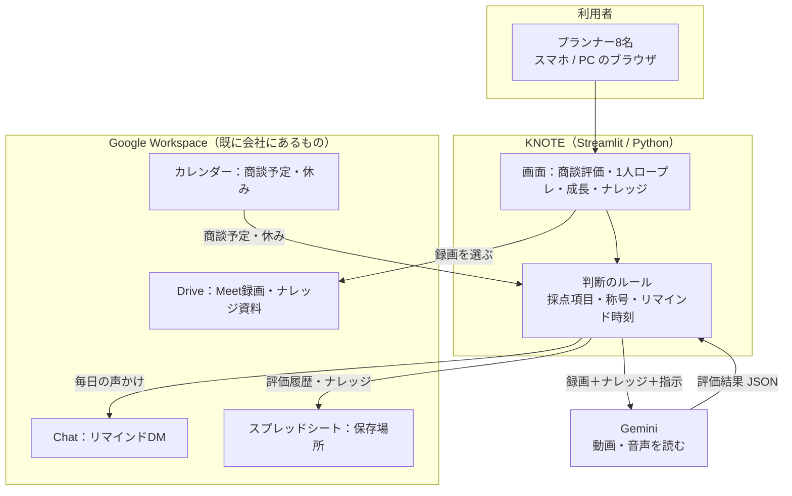
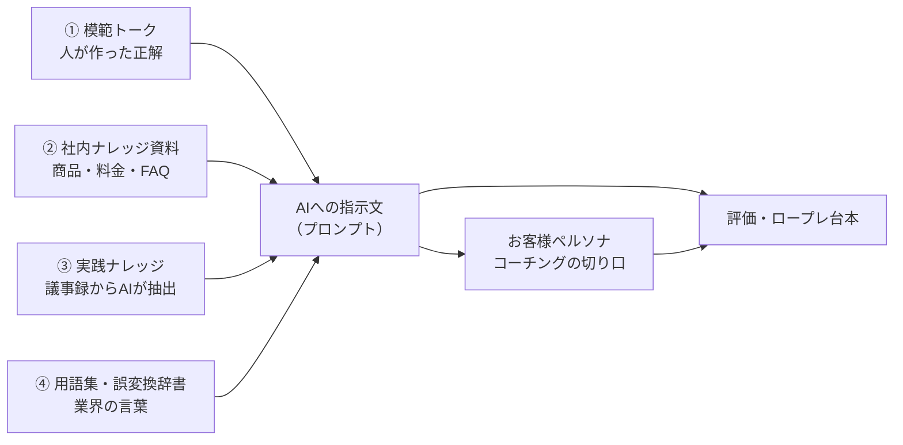
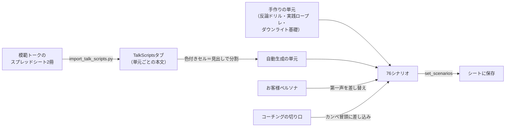
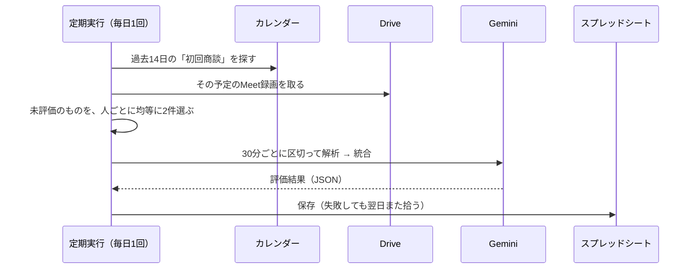

# KNOTE 設計書 ― 他部署版をつくるための引き継ぎ資料

**この資料は「施工部版を新しく作る人（とそのAI）」に渡すためのものです。**
KNOTE（ノート）は営業部向けに作った「商談・ロープレをAIが振り返るWebアプリ」です。
ここには、**同じものをもう一度作れるだけの設計・データ構造・ナレッジの持ち方・
実際に踏んだ失敗**を書いてあります。

| | |
|---|---|
| 対象読者 | 施工部版を作る担当者、および その人が使うAI（Claude Code 等） |
| 現状 | 営業プランナー8名が毎日利用中。コード約1万行・自動テスト479件・稼働5か月 |
| URL | https://talknot-lts.streamlit.app （社内ドメインのGoogleアカウントのみ） |
| リポジトリ | GitHub `LTSplanner/talknot`（main へのpush＝本番反映） |

> **この資料に秘密情報は含まれていません。** APIキー・サービスアカウントの鍵・
> お客様の個人情報は一切書いていません。書いてあるスプレッドシートIDと
> DriveフォルダIDは社内共有物で、開くには別途 権限が必要です。
> 社外には出さないでください。

> **AIに渡すときの使い方**：この資料を読ませたうえで
> 「§17 の手順に沿って、施工部版の要件定義から始めて」と指示すると話が早いです。
> コードそのものが必要なら、リポジトリ全体を渡してください。

---

## 目次

1. [このアプリが解いている問題](#1-このアプリが解いている問題)
2. [全体像](#2-全体像)
3. [技術スタックと動かし方](#3-技術スタックと動かし方)
4. [設計の柱（5つ）](#4-設計の柱5つ)
5. [ナレッジの考え方](#5-ナレッジの考え方ここが移植の核心)
6. [AIの入れ方](#6-aiの入れ方)
7. [評価の仕様](#7-評価の仕様)
8. [1人ロープレの仕様](#8-1人ロープレの仕様)
9. [商談の自動評価](#9-商談の自動評価)
10. [続けさせる仕組み](#10-続けさせる仕組み)
11. [保存の設計](#11-保存の設計)
12. [権限とセキュリティ](#12-権限とセキュリティ)
13. [自動で動いているもの](#13-自動で動いているもの)
14. [テストの考え方](#14-テストの考え方)
15. [実際に起きた事故と対策](#15-実際に起きた事故と対策一覧)
16. [ファイル構成](#16-ファイル構成)
17. [施工部版のつくり方](#17-施工部版のつくり方)
18. [費用と制約](#18-費用と制約)

---

## 1. このアプリが解いている問題

営業の「うまい人のやり方」は、その人の頭の中にしかありませんでした。

- 商談に同行できる回数は限られる。上長が全員の商談を見るのは物理的に無理
- 振り返りは記憶頼りで、「なんとなく良かった／悪かった」で終わる
- 新人が伸びるかどうかが、たまたま誰の下についたかで決まってしまう

KNOTE はここに **「全員の商談を、同じ基準で、毎回言語化する」** 仕組みを入れました。

**施工部に置き換えると**：ベテランの段取り・納まりの判断・お客様対応が個人の頭にあり、
若手が同じ品質に届くまで時間がかかる、という同じ構造の問題に使えます。

---

## 2. 全体像



**特徴は「新しいものをほとんど増やしていない」こと**です。
保存先はスプレッドシート、動画はDrive、連絡はGoogle Chat、予定はカレンダー。
会社に既にあるものをつなぎ、足りない「AIで読む」「基準で採点する」だけを作っています。
専用サーバーもデータベースも要らず、費用はほぼゼロで運用できています。

---

## 3. 技術スタックと動かし方

### 使っているもの

| 役割 | 採用したもの | 補足 |
|---|---|---|
| 画面 | **Streamlit**（Python） | HTML/JSを書かずに画面が作れる。1人で保守するのに最適 |
| AI | **Google Gemini 2.5 Flash** | 動画・音声をそのまま読める。議事録抽出は軽量な flash-lite |
| ログイン | Google OAuth | 社内ドメイン限定 |
| 他人のデータ参照 | サービスアカウント＋**ドメイン全体委任(DWD)** | 8名のDrive/カレンダーを代理で読む |
| 保存 | Googleスプレッドシート | §11 |
| 定期実行 | GitHub Actions | §13 |
| ホスティング | Streamlit Community Cloud（無料） | main へのpushで自動デプロイ |

### 依存パッケージ（`requirements.txt`）

```
streamlit>=1.40              画面
python-dotenv>=1.0           .env 読み込み
google-auth / -oauthlib / google-api-python-client   OAuth・Drive・カレンダー・Chat・Sheets
google-genai>=0.3            Gemini
google-cloud-storage>=2.16   （任意）GCSに保存する場合
extra-streamlit-components   ログイン保持のCookie
imageio-ffmpeg               長尺動画の分割（ffmpegバイナリ同梱・別途インストール不要）
```

### ローカルで動かす

```bash
pip install -r requirements.txt
pip install -r requirements-dev.txt   # pytest
cp .env.example .env                  # 編集が必要
streamlit run app.py                  # http://localhost:8501
pytest                                # テスト479件（ネットワーク不要・約10秒）
python3 scripts/check_setup.py        # .env点検＋Gemini接続テスト
```

`GOOGLE_CLIENT_ID` が未設定ならデモログインに落ちるので、UIの見た目だけなら鍵なしで確認できます。

### 本番に必要な設定（Streamlit Cloud の Secrets / GitHub の Secrets）

| キー | 用途 |
|---|---|
| `GOOGLE_CLIENT_ID` / `GOOGLE_CLIENT_SECRET` / `OAUTH_REDIRECT_URI` | ログイン |
| `GEMINI_API_KEY` | AI |
| `KNOWLEDGE_SHEET_ID` / `KNOWLEDGE_SA_JSON` | 保存先シートと、その書き込み用サービスアカウント |
| `GOOGLE_SERVICE_ACCOUNT_FILE`（or JSON） | 他人のDrive録画を読むDWDアカウント |
| `CALENDAR_SA_JSON` | 商談予定・休みの判定 |
| `CHAT_SA_JSON` / `CHAT_ADMIN_SUBJECT` | Google ChatのDM送信 |
| `ALLOWED_DOMAINS` / `ADMIN_EMAILS` / `VIEWER_EMAILS` / `CANARY_EMAILS` | 権限 |
| `TARGET_ACCOUNTS` | 評価対象の8名 |

セットアップ手順は `docs/SETUP.md` / `SETUP_SERVICE_ACCOUNT.md` / `SETUP_KNOWLEDGE_SHEET.md` /
`SETUP_REMINDERS.md` にあります。**鍵は絶対にコードやこの資料に書かないこと。**

---

## 4. 設計の柱（5つ）

### ① ナレッジは「唯一の真実」を1か所に置く

同じことを2か所に書くと、必ず片方が古くなります。KNOTE では

- 評価項目（5項目）は `config/settings.py` の1か所にだけ書く
- 画面表示も、AIへの指示文も、結果の保存形式も、**すべてそこを参照する**

としています。項目を増やすときに直すのは1か所だけ。ズレようがない構造です。

### ② AIは「読む・書く」係。判断の基準は人が持つ

AIに丸投げすると、日によって甘口・辛口が変わり、評価として信用されません。

| 人が決めること（コードに書く） | AIに任せること |
|---|---|
| 何を評価するか（5項目・2視点） | 録画から何が起きたかを読み取る |
| 何点なら高評価か（20点以上＝良い回） | その場面がどの項目に当たるか判断する |
| 称号の条件・相棒の育ち方 | 改善案の文章を書く |
| リマインドを送る時刻・休みの判定 | 議事録から実践ナレッジを抜き出す |

「ものさしは人が持ち、目と口をAIに任せる」。この線引きが評価の一貫性を守っています。

### ③ 保存はスプレッドシート

データベースを立てていません。理由は3つ。

1. **中身を人が直接見て直せる**（管理者がシートを開けば全記録が読める）
2. 権限管理・バックアップ・共有がGoogle任せで済む
3. サーバー代・保守がかからない

「開発者しか触れないブラックボックス」を作らないための選択です。

### ④ 続けさせる仕組みを、機能として作る

良いツールでも使われなければ意味がありません。**続ける動機**そのものを機能にしています（§10）。

### ⑤ 段階的に出す

毎日使う人がいるので、いきなり全員には出しません。
まず1名（`CANARY_EMAILS`）で確認 → 問題なければ全員。
画面に出る機能は**機能フラグ**で隠せるようにしてあり、コードを入れても表示は変わりません。

```python
# config/settings.py
FEATURE_COMPANION = _bool_env("FEATURE_COMPANION", False)   # 既定OFF
_FEATURE_FLAGS = {"companion": FEATURE_COMPANION, ...}

# 画面側
if settings.feature_visible("companion", user["email"]):    # 対象者と管理者だけ True
    ...
```

詳細は `docs/RELEASE_FLOW.md`。

---

## 5. ナレッジの考え方（ここが移植の核心）

AIは賢いですが、**自社のことは何も知りません**。「弊社のダウンライトはLDKのシーリングを
置き換える工事だ」ということは、教えない限り分かりません。実際、教える前は
「玄関・廊下の人感センサー照明」の話としてロープレ台本が作られていました。

そこで社内の知識を**4つの層**に分けて持っています。



| 層 | 中身 | 誰が作る | 更新のしかた |
|---|---|---|---|
| ① 模範トーク | 社内標準の話し方。単元（会社説明・コーティング…）ごとの台本 | 人（営業の上長） | 元のスプレッドシートを直す → 取り込み |
| ② 社内ナレッジ資料 | 商品仕様・料金・サービス・FAQ | 人 | Driveのフォルダに置く → 画面のボタンで取り込み |
| ③ 実践ナレッジ | 実際の商談議事録から「使えた切り返し」をAIが抽出したもの | AI（毎日自動） | 議事録が増えれば自動で増える |
| ④ 用語集・誤変換辞書 | 入隅・出隅・巾木・引掛シーリング等。AIが聞き間違えやすい語 | 人 | 誤変換を見つけたら1行足す |

### なぜ4層に分けるのか

- **①②は変えてはいけない正解**。AIに書き換えさせない
- **③は増え続ける生の知恵**。人が書く余裕はないのでAIに集めさせる
- **④は精度の問題**。「入隅」→「入り墨」、「安栗（あぐり）さん」→「アングリさん」と
  誤変換された実例があり、辞書と確定情報で潰しています

### ナレッジの実際の置き場所

「どこを直せばAIの答えが変わるか」が分かるように、実物の場所を書いておきます。
リンク先を開くには、それぞれの共有権限が必要です。

| 層 | 実物 | 場所 |
|---|---|---|
| ① 模範トーク（商材別・14タブ） | スプレッドシート | [1bUrsQxKIg7D…](https://docs.google.com/spreadsheets/d/1bUrsQxKIg7DZc-DANvHRqR4ygeEQEOvckZTpeGlmyEs/) |
| ① 模範トーク（説明トーク部品別・22タブ） | スプレッドシート | [1A92RANfvc9z…](https://docs.google.com/spreadsheets/d/1A92RANfvc9zQz18b9aG4fnSlurKAqBVr0iWAzGSAX1k/) |
| ② 社内ナレッジ資料（商品・料金・FAQ） | Driveフォルダ | [15Q4Ei08Xubf…](https://drive.google.com/drive/folders/15Q4Ei08Xubfib_0T2HcwYpdk93BDudl8) |
| ③ 実践ナレッジの元（商談議事録） | Driveフォルダ | [14yefycrO6yl…](https://drive.google.com/drive/folders/14yefycrO6ylPVT0LAqbh10HjrDV-9FDd) |
| ④ 用語集・誤変換辞書 | コード内 | `config/settings.py`（`INDUSTRY_GLOSSARY` / `TRANSCRIPT_FIXES`） |
| 商談・ロープレの録画 | 各自のDrive（Meet録画） | サービスアカウントが**読み取り専用**で参照 |
| 保存先（評価履歴・ナレッジ） | スプレッドシート | IDは Secrets 管理（`KNOWLEDGE_SHEET_ID`） |
| 利用ログ（LTS共通） | スプレッドシート | [17et2dnkgLsx…](https://docs.google.com/spreadsheets/d/17et2dnkgLsxpb9cdbKgDRmmkI5hB_LYyMYtqxZhIhUU/) |

### 取り込みの入口

| やりたいこと | 操作 |
|---|---|
| 模範トークを更新した | `scripts/import_talk_scripts.py` を実行（**色付きセルを【見出し】として構造化**して取り込む） |
| ロープレの台本に反映したい | GitHub Actions の `rebuild-scenarios` を手動実行（既定は dry-run） |
| 社内ナレッジ資料を追加した | アプリの管理者画面のボタンから取り込み |
| 議事録を追加した | 何もしなくてよい（毎日自動で抽出される） |

フォルダIDは `config/settings.py` に既定値として書いてあります（鍵ではないので
コードに入れて構いません）。差し替えは `.env` / Secrets で上書きできます。

### 派生して作られるもの

①〜④から、AIが次の2つを自動生成します（人が確認して直せます）。

- **お客様ペルソナ** … 実際の議事録から作った「よくあるお客様の反応・不安・口ぐせ・断り文句」。
  ロープレのお客様の第一声に使う（`scripts/build_customer_persona.py`）
- **コーチングの切り口** … 商材×お客様タイプごとの「どう進めるとよいか」。
  ロープレのカンペの冒頭に差し込む（`scripts/build_coaching_tips.py`）

### 施工部で作るなら

| KNOTE（営業） | 施工部での対応物（例） |
|---|---|
| 模範トーク | 標準施工手順・納まりの基準・現場写真の良い例 |
| 社内ナレッジ資料 | 商品仕様・施工要領書・注意点・安全基準 |
| 実践ナレッジ | 日報・是正報告・クレーム記録からAIが抽出した「現場の学び」 |
| 用語集 | 建築用語・部材名（**そのまま流用できます**） |
| お客様ペルソナ | 現場でよくある状況（前工程の遅れ・図面と現物の相違・在宅施工 等） |

---

## 6. AIの入れ方

### 使う場面と、あえて使わない場面

| 場面 | AIを使うか | 理由 |
|---|---|---|
| 商談録画の評価 | 使う | 人が全部見るのは不可能 |
| ロープレの評価 | 使う（**最後に1回だけ**） | — |
| **ロープレの会話中** | **使わない** | 台本で進める。毎ターンAIを呼ぶと費用も待ち時間も増える |
| 議事録からの知恵の抽出 | 使う（毎日自動） | 量が多く、人手では続かない |
| 模範トークの整文 | 使う（管理者が押したときだけ） | 案を出すだけ。採用は人が決める |
| 採点の基準・称号の判定 | 使わない | ブレたら評価として信用されない |
| リマインドの送信判断 | 使わない | 深夜に送る等の事故を確実に防ぐ |

### プロンプトの組み立て（`core/prompts.py`）

指示文は毎回、次のブロックを順に連結して作ります。

| ブロック | 中身 | なぜ必要か |
|---|---|---|
| 役割 | 「あなたは住宅インテリアオプション営業のコーチです」 | 評価の視点を固定 |
| `_meeting_context_block` | **確定情報**（カレンダー予定名から取ったお客様名・物件名・担当者名） | これが無いとAIは聞き取れない人名をカタカナで創作する |
| `_glossary_block` | 業界用語集 | 「入隅」等の誤変換を防ぐ |
| ナレッジ | 模範トーク・社内ナレッジ・実践ナレッジ | 自社基準で採点させる |
| `_persona_block` | お客様ペルソナ | ロープレ時のみ |
| `_segment_block` / `_coverage_block` | 「これは全体の何分〜何分か」「各区間から最低2件は拾え」 | 長尺で前半だけ評価される問題の対策 |
| `_previous_block` | 前回の宿題（1点） | できたか答え合わせさせ、積み上げにする |
| 出力形式 | JSONの厳密な指定 | §7のスキーマどおりに返させる |

### 出力を壊さないための工夫（`services/gemini_analyzer.py` / `core/models.py`）

AIの出力は不安定です。そのまま信じると画面が壊れます。

| 起きたこと | 対策 |
|---|---|
| JSONが途中で切れる | `repair_truncated_json` で修復してから読む／再試行時は厳格指示を追加 |
| 26点／25点満点になる | 定義にない項目キーを捨てる（`settings` にある5キーだけ通す） |
| 時系列が前後する（02:44 → 01:50） | 保存時に時刻順へ並べ直す |
| 「もちろん」が300回続く | 繰り返しを畳む（`_collapse_repetition`） |
| 通信が切れる／503／429 | 一時的なエラーとレート上限だけ待って再試行 |
| 長い録画の前半しか評価されない | **30分ごとに区切って解析 → 統合**（読み取り3%→97%） |
| スマホの録音が大きすぎて落ちる | 録音を16kHzモノラルに変換（37MB→6MB）。8MB超はFiles API経由 |

### 長い録画の分割（`core/chunking.py`）

45分を超える録画は30分ごとに切って解析し、結果を統合します（末尾5分未満は前の区間に併合）。
統合時は、指摘とニーズは連結、点数とジョハリは平均。
**1ポイントと総括だけは、統合結果を材料にもう一度AIに書かせます**（区間ごとの寄せ集めでは
「今日の一番の課題」が決まらないため）。

### 費用の抑え方

- モデルを用途で使い分け（評価＝`gemini-2.5-flash`、議事録抽出＝`gemini-2.5-flash-lite`）
- 自動評価は**1日2件まで**（`AUTO_EVAL_DAILY_LIMIT`）。残りは翌日に持ち越し
- 動画はフレームを間引いて（0.5fps）読む。身振りは十分読み取れて費用は下がる
- ロープレのAI呼び出しは1セッション1回だけ
- 区間解析の間に20秒あける（無料枠のレート上限に当てない）

---

## 7. 評価の仕様

### 5項目 × 2視点

`config/settings.py` の `EVALUATION_CRITERIA` が唯一の真実です。

| キー | 項目 |
|---|---|
| `emotion_catch` | お客様の感情をつかめたか |
| `background_depth` | お客様の背景を深掘りできたか |
| `excitement` | ワクワクを引き出せたか |
| `adaptability` | 臨機応変に対応できたか |
| `additional_consideration` | 追加検討が増えたか |

各項目を2つの視点で1〜5点：**`reference`（模範トーク視点）** と **`sales`（営業プロ視点）**。
合計25点満点で、**20点以上を「良い回」**として称号や相棒の経験値に使います。

### 評価結果のJSONスキーマ（`core/models.py`）

```jsonc
{
  "scores": [                       // 5項目ぶん
    {"key": "emotion_catch", "reference_score": 4, "reference_comment": "…",
     "sales_score": 3, "sales_comment": "…"}
  ],
  "johari": {                       // 会話配分（ジョハリの窓）
    "open_pct": 40, "blind_pct": 25, "hidden_pct": 25, "unknown_pct": 10, "comment": "…"
  },
  "hidden_needs": [                 // 隠れたニーズ（件数制限なし）
    {"timestamp": "00:12:30", "signal": "お客様の発言", "inferred_need": "推測した本音",
     "surfaced": false, "note": "どう拾えばよかったか"}
  ],
  "feedback": [                     // 決定的な場面（時系列・件数制限なし）
    {"timestamp": "00:08:15", "criterion_key": "background_depth",
     "emotion_note": "この時お客様は…", "before": "実際の発言", "after": "こう言えたら",
     "customer_line": "直前のお客様の言葉"}
  ],
  "summary": "全体の振り返り",
  "knowledge": [{"category": "切り返し", "point": "…"}],   // 実践ナレッジへ蓄積
  "customer_profile": {"attributes": ["共働き", "小さいお子様"],
                       "summary": "人物像", "next_approach": "次回の攻め方"},
  "one_point": {                    // 画面の最上部に大きく出す「次に直す1点」
    "headline": "…", "timestamp": "00:08:15", "reason": "…",
    "action": "次回そのまま言えるセリフ", "keep": "続けるとよい良かった点"},
  "follow_up": {                    // 前回の宿題の答え合わせ
    "previous_headline": "…", "status": "done|partial|not_yet",
    "timestamp": "00:05:00", "comment": "…"}
}
```

**設計意図**：見る項目が多すぎると「で、何を直せばいいの？」になります。
そこで画面は `one_point`（次に直す1点）を最上段に大きく出し、点数・ジョハリ・
シーン別は下にたたんでいます。**改善は1回に1つだけ**が続く条件です。

---

## 8. 1人ロープレの仕様

相手役がいなくても1人で練習できる機能。**KNOTEで一番使われている画面**です。

### 進み方

```
カテゴリを選ぶ → 単元を選ぶ → 「今日のお客様」が引かれる
  → 台本のお客様が話す（音声合成で読み上げ）
  → マイクで返答（40秒目安）→ 自動で次のターンへ
  → 全ターン終了 → 「AIで評価する」→ 1回だけAI呼び出し → 評価画面へ
```

- カンペ（模範トーク）は **「見ずに言えたら次へ」** の建て付け。見たかどうかも記録
- 途中で「今の録音をやり直す」ができる
- 会話中はAIを呼ばない（費用・待ち時間の両方を抑える）

### 台本のデータ構造（シナリオ）

```jsonc
{
  "id": "dl_base_u",
  "group": "ダウンライト",                  // カテゴリ（画面の第1プルダウン）
  "title": "ダウンライト（LDKのシーリング置き換え）",   // 単元（第2プルダウン）
  "customer_type": "未検討",                // 検討済み / 未検討
  "level": 1,                               // 1=基礎, 2=応用（アドリブが増える）
  "keep_opening": true,                     // 手作り台本＝第一声を差し替えない
  "focus": "この単元で特に見る観点（任意）",
  "turns": [
    {"customer": "お客様のセリフ",
     "hint": "カンペ（モデルトーク・切り口例）",
     "variants": [ {"customer": "…", "hint": "…", "dialog": ["…","…"]} ]  // 任意
    }
  ]
}
```

- `variants` があるターンは、セッション開始時に1つ選んで固定（毎回同じ会話にしない）
- `dialog` は1ターン内でお客様が複数回話す往復ロープレ用
- **管理者が画面で直したセリフ・カンペは `overrides` に別保存**され、
  台本を作り直しても消えません

### 現在の構成（76シナリオ ＝ 38単元 × お客様タイプ2）

| カテゴリ | 単元数 | 例 |
|---|---|---|
| 導入 | 7 | 信頼構築、会社説明、商談の導入、内覧会同行、締め |
| コーティング | 8 | 種類を話す前の導入、ガラス、UV、シリコン、セラミック、水回り |
| エコカラット | 4 | エコカラット、価格の説明、エアコンふかし壁 |
| ダウンライト | 2 | LDKのシーリング置き換え、人感センサー照明 |
| 反論対応（3商材） | 16 | 高い／必要性を感じない／他社の方が安い／後でいい 等 |
| 実践ロープレ | 1 | 初回商談ロープレ（西村家ご家族＝研修用の架空ペルソナ） |

### 台本ができるまで（`scripts/build_roleplay_scenarios.py`）



**自動生成だけに頼らないこと**が重要です。ダウンライトは「住設タブの人感センサーの節」から
自動生成していたため、実際の施工（LDKのシーリング置き換え）と食い違っていました。
**商品説明の中核は手作りの単元で持つ**のが正解でした。

### 飽きさせない仕組み（`core/roleplay_variety.py`）

台本は数回で暗記でき、読み上げ作業になります。そこで毎回引き直します。

| 要素 | 中身 | 組み合わせ |
|---|---|---|
| 🎲 今日のお客様 | 温度感（前のめり／慎重／時間がない／比較中／おまかせ）× 同席者（ご夫婦／奥様おひとり／お子様連れ／ご両親同席…）× 気にしていること（予算／お手入れ／入居まで／ペット…） | **175通り** |
| 🎲 アドリブ | 台本にない横やり質問が途中で割り込む（「結局いくら？」「主人に相談しないと」…） | 16種・返し方の例つき |
| 🎯 今日のミッション | 話し方の縛り（数字を1つ入れる／専門用語を使わない／沈黙を2秒待つ…） | 12種 |

**セッション中は固定**（seedで決める）。画面のセリフ・音声・AI評価がずれると評価が成立しません。

---

## 9. 商談の自動評価

プランナーが**何もしなくても**、翌日には自分の商談の振り返りが増えている、という体験です。



対象の選び方（`core/auto_eval.py`）でハマった点：

- **「初回商談」だけを対象**にする。`仕様MT`（仕様打合せ）と単独の `SR` は除外
- `AUTO_EVAL_START_DATE` より前は対象外（稼働前の過去分を一気に評価しない）
- 失敗した案件は**翌日また拾う**（最大3回まで）。エラーで放置されない
- **人ごとの評価数でラウンドロビン**。放っておくと商談が多い人ばかり評価され、
  「私の商談だけ評価されない」という不公平が起きる

---

## 10. 続けさせる仕組み

評価が良くても、使わなくなれば終わりです。次の4つを機能として入れています。

| 仕組み | 中身 |
|---|---|
| **称号（110種）** | 「初めの一歩」「7日連続」「20点以上を10回」など。20代前半〜40代の女性が多い職場なので、幅広く刺さるよう種類を多くした。習慣系は20段階で最終が365日 |
| **相棒キャラクター** | ロープレを続けると育つドット絵のキャラ。6種族×8段階。**育つのは選んだ1体だけ**（乗り換えると前の子はその姿のまま図鑑に残る）。名前を付けられる |
| **毎日の声かけ** | 未実施の人にGoogle ChatでDM。文面は**30種を日替わり**。**各自のカレンダーで休みを判定**（「OFF」「有給」等の予定があれば送らない）。送信は**日本時間14〜17時のみ** |
| **ロープレの揺らぎ** | §8のとおり |
| **ご意見箱** | 要望・不具合を画面から投稿 → 共有シートに自動保存。ホストはシートを見るだけ |

### 相棒の設計（`core/companion.py` / `companion_defs.py` / `pixel_sprites.py`）

- 経験値 ＝ 1本10 ＋ 20点以上なら+5 ＋ その相棒と続けた最高連続日数×3
- 段階のしきい値は `0, 60, 180, 400, 750, 1250, 1900, 2700`（後半ほど遠い）。
  毎日1本で**最終段階まで約200本＝半年強**
- **状態はほぼ保存しない**。「いつ・どの子に乗り換えたか」だけ保存し、経験値は
  ロープレ履歴から毎回計算する。育ち方を後から調整しても過去にさかのぼって反映される
- ドット絵は画像ファイルではなく**コードで描いて2コマ動かす**（16×16のSVG）
- **叱らない**。放置しても死なず・退化せず、眠って待つだけ

### 声かけの設計（`core/reminders.py` / `scripts/send_roleplay_reminders.py`）

- 「今日やれば◯日つづけて達成」を、続いている人にだけ添える（途切れた人に追い打ちしない）
- 相棒の成長も1行添える
- **送信時刻はcronに頼らずコードで判定**（理由は§13）
- 送った相手は `ReminderLog` に記録し、同じ日に二重で送らない

---

## 11. 保存の設計

すべて1つのスプレッドシートの中で、タブで分けています。

| タブ | 列 | 中身 |
|---|---|---|
| **Evaluations** | `job_id, user_email, saved_at, status, label, result_json, error` | 評価履歴。`status` は `processing / done / error` |
| Knowledge / KnowledgeDoc | — | 弊社ナレッジ（箇条書き／まとまった文書） |
| TalkScripts | `book, tab, body` | 模範トークスクリプト（単元ごと） |
| MeetingInsights | — | 議事録から抽出した実践ナレッジ |
| ReminderLog | `date, user_email, sent_at` | その日送った相手（二重送信の防止） |
| Feedback | `送信日時, 送信者, 種別, 内容, 対応状況` | ご意見箱 |
| Companion | `メール, 選択中, 乗り換え履歴, 名前, 更新日時` | 相棒の選択・名前 |

### 保存で必ず守ること（事故った箇所）

> **1セルは50,000文字まで。** 長い評価結果はそのままだと保存に失敗します。
> KNOTEでは「重要な部分（1ポイント・点数・要約）を残し、長い部分（隠れたニーズ→
> シーン別指摘）から削る」ようにしています（`_fit_cell`）。

> **必ず「先に書いてから、余った行を消す」順にすること。**
> 以前は「全消し→書き込み」の順で、巨大な評価がセル上限に当たって書き込みが失敗し、
> **ロープレの記録17件が全消しになりました**。順番を逆にするだけで防げます。

---

## 12. 権限とセキュリティ

- ログインはGoogleアカウント。**社内ドメインのみ**許可（`ALLOWED_DOMAINS`）
- 権限は3段階
  - 一般：自分の記録だけ
  - 閲覧専用（`VIEWER_EMAILS`）：全員の記録を見られるが編集は一切できない
  - 管理者（`ADMIN_EMAILS`）：ナレッジ・模範トーク・台本の編集
- 他人の録画を読むサービスアカウントは**読み取り専用スコープ**
- 鍵は GitHub Secrets と Streamlit Secrets にのみ置く。コード・ドキュメントに書かない
- 録画・評価結果の実体はリポジトリに入れない（`.gitignore` 済み）

---

## 13. 自動で動いているもの

| 名前 | 頻度 | 役割 |
|---|---|---|
| `auto-evaluate` | 毎日1回 | 初回商談の自動評価（1日2件） |
| `roleplay-reminder` | **1時間ごと** | 14〜17時の実行のときだけ送信 |
| `daily-minutes` | 毎日 | 議事録から実践ナレッジを抽出 |
| `keepalive` | 定期 | アプリを起こしておく |
| `rebuild-scenarios` | 手動 | ロープレ台本の作り直し（既定 dry-run） |

> **GitHub Actions の定期実行は、指定時刻どおりには動きません。**
> 実測で1〜3時間、最大12時間遅れました。「12:40指定の実行が翌0:38に走り、
> プランナーに深夜DMが届いてクレーム」という事故が起きています。
> 対策は **1時間ごとに起動して、送ってよい時刻かはコード側で判定**する形。
> 時刻に意味がある処理では、cronの時刻を信用しないでください。

---

## 14. テストの考え方

自動テスト479件（20ファイル・約10秒）。**テストは「壊れたら困る約束」を日本語で書く**。

```python
def test_midnight_is_blocked():
    """深夜に届かないための門番。実際に 0:37 にDMが飛ぶ事故が起きた。"""
    assert not reminders.is_within_send_window(self._at(0, 37))
```

- **過去に一度でも起きた事故は、必ずテストにする**
- テストは仕様書も兼ねる（読めば「何を守っているか」が分かる）
- `core/`（外部通信なし）と `services/`（外部通信あり）を分けているので、
  テストはネットワーク不要で速い

---

## 15. 実際に起きた事故と対策（一覧）

移植する人が同じ穴を踏まないように、全部書いておきます。

| 事故 | 原因 | 対策 |
|---|---|---|
| 人名を「アングリさん」と創作 | 音声だけでは固有名詞が取れない | カレンダー・Driveから**確定情報**を渡し、推測でのカタカナ表記を禁止 |
| 「入隅」→「入り墨」 | 業界用語を知らない | 用語集＋誤変換辞書 |
| 長い商談の最初の10〜15分しか評価されない | 長尺だと後半の注意が薄れる | プロンプト改善では直らず、**30分ごとの分割解析**で解決（3%→97%） |
| ロープレの記録17件が全消し | 「全消し→書き込み」順＋セル上限超過 | **書いてから消す**順に変更＋長い結果を削って収める |
| 評価が26点／25点になる | 定義にない項目をAIが作る | 未知のキーを捨てる |
| 深夜にDMが届く | cronの遅延（12:40→翌0:38） | 時刻判定をコード側に移動＋1時間ごと起動＋送信済み記録 |
| 無料枠を使い切って429 | 1日に何件も評価した | 1日2件＋区間ごとに20秒あける |
| 商談評価が特定の人に偏る | 古い順に処理していた | 人ごとのラウンドロビン |
| 土日が評価されない | 平日だけの前提になっていた | 評価は365日。休むのはリマインドだけ（各自のカレンダー基準） |
| スマホからの評価が失敗しやすい | 48kHzステレオ録音×5ターンで約37MB→メモリ1GBで落ちる | 録音を16kHzモノラルへ（6MB）＋8MB超はFiles API |
| ダウンライトの台本が実際の施工と違う | 模範トークの別の節から自動生成していた | **商品説明の中核は手作り単元で持つ** |

---

## 16. ファイル構成

```
app.py                  画面（唯一の入口。ログイン → タブUI。約1,600行）
config/settings.py      設定・評価項目・用語集・機能フラグ（唯一の真実）
core/                   判断のルール（外部通信を含まない＝テストしやすい）
  prompts.py            AIへの指示文の組み立て
  models.py             評価結果の形と正規化（壊れた出力の受け止め）
  chunking.py           長い録画の分割と統合
  meeting_context.py    予定名から確定情報（お客様名・物件名）を作る
  auto_eval.py          自動評価の対象選定（初回商談判定・ラウンドロビン）
  badges.py/badge_defs.py  称号110種の判定と定義
  companion.py/companion_defs.py/pixel_sprites.py  相棒（育ち方・図鑑・ドット絵）
  roleplay_variety.py   ロープレの揺らぎ
  reminders.py          休み判定・送信時間帯
  progress.py           次に直す1点の引き継ぎ
  audio_prep.py         録音を16kHzモノラルに落とす
services/               外部とのやり取り
  gemini_analyzer.py    AI呼び出し（分割解析・再試行・JSON修復・Files API）
  google_drive.py / drive_sa.py   録画の取得（本人OAuth / 代理アクセス）
  google_calendar.py    商談予定・休みの取得
  google_chat.py        リマインドDM
  sheets_knowledge.py   スプレッドシートの読み書き
  storage.py            保存の入口（シート/GCS/ローカルの違いを吸収）
  meeting_extractor.py  議事録から実践ナレッジを抽出
ui/theme.py, components.py   ブランドカラー・画面部品
scripts/                取り込み・生成・定期実行の処理
tests/                  自動テスト479件
docs/                   資料（この文書もここ）
.github/workflows/      定期実行の定義
```

---

## 17. 施工部版のつくり方

### 差し替えるのは3か所だけ

骨組み（ログイン・保存・AI呼び出し・自動実行・称号・相棒・リマインド）はそのまま使えます。

| 差し替えるもの | 具体的に |
|---|---|
| **① 評価項目** | 5項目を施工の評価軸に置き換える（例：安全確認／納まりの精度／お客様への説明／段取り／後片付け） |
| **② ナレッジ** | 模範トーク→標準施工手順／社内資料→施工要領書／実践ナレッジ→日報・是正記録 |
| **③ 入力するもの** | 商談録画 → 現場写真・施工動画・日報 |

### 進め方（この順番が大事）

1. **「何を良しとするか」を紙に5項目書く**
   ここが決まらないと何も作れません。KNOTEも評価5項目を決めるのに一番時間をかけました。
   ベテラン2〜3名に「若手の現場を見て、どこを見るか」を聞いて言語化するのが早いです。
2. **手元の写真か動画を1件、AIに読ませて出力を見る**（コードを書く前でOK）
   Gemini に「この施工写真を次の5項目で1〜5点で評価し、JSONで返して」と投げるだけ。
   ここで使えそうな出力が出るかを先に確かめます。**出なければ項目の書き方を直します。**
3. **ナレッジを1つだけ入れて、出力が変わるか確かめる**
   施工要領書を1本渡して、指摘が具体的になるかを見る。
   これが効けば、この仕組みは施工部でも成立します。
4. **KNOTEのコードをコピーして ①②③ を差し替える**
   `config/settings.py` の評価項目 → `core/prompts.py` の文言 → 入力元、の順。
5. **保存先のスプレッドシートを1枚用意**（タブは自動で作られます）
6. **1人で1週間使う**（先行公開）。ここで必ず「日本語が変」「そこじゃない」が出ます
7. **称号・相棒・リマインドを足して、続く形にする**（ここは丸ごと流用できます）

### 最初から作らなくてよいもの

称号・相棒キャラ・ドット絵・リマインドの休み判定・ご意見箱・ジョハリの窓は
**そのまま持っていけます**。営業/施工で中身が変わるのは、評価項目とナレッジだけです。

---

## 18. 費用と制約

| 項目 | 現状 |
|---|---|
| AI利用料 | 無料枠内（1日2件に制限して収めている） |
| サーバー | Streamlit Community Cloud（無料・**メモリ1GB**） |
| 保存 | Googleスプレッドシート（既存のWorkspace） |
| 制約 | 長い動画・大きな録音は分割・圧縮が必須。1セル5万文字 |

> **無料枠では、送信した内容がGoogleのサービス改善に使われます。**
> お客様の録画を扱う以上、本来は有償枠が望ましい点は認識のうえで運用しています。
> 施工部で個人情報や現場写真を扱う場合は、**ここを最初に判断**してください。
> 有償枠に切り替えるのはAPIキーの設定変更だけで、コードの変更は不要です。

---

## 相談窓口

このアプリの設計・実装について：熊田（hkumada@life-time-support.com）

作りたいものが決まっていなくても、「何を良しとするか」を一緒に整理するところから
始められます。
